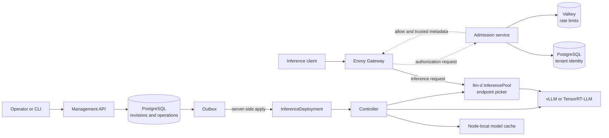
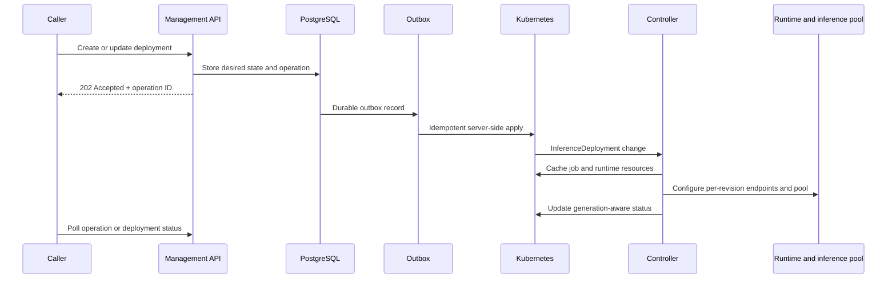
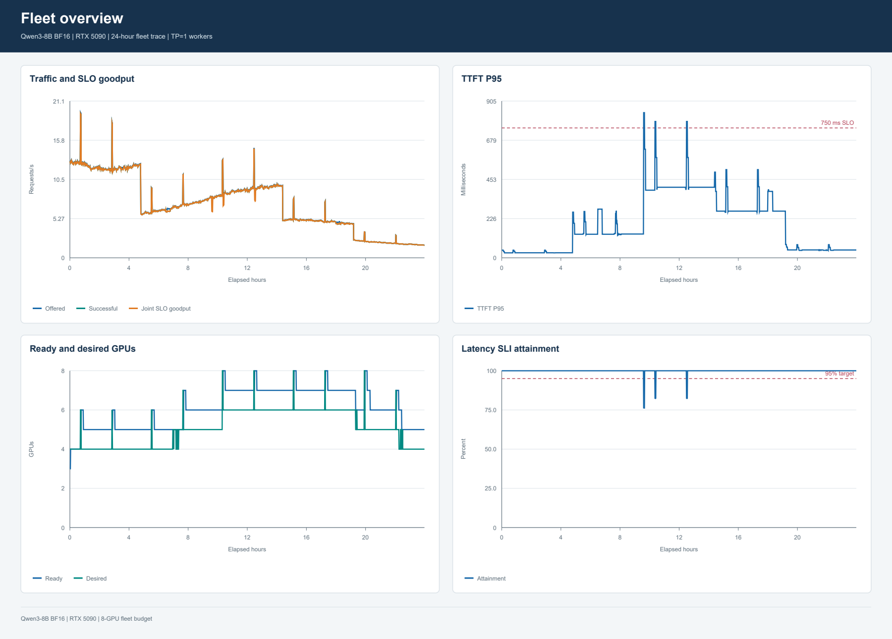
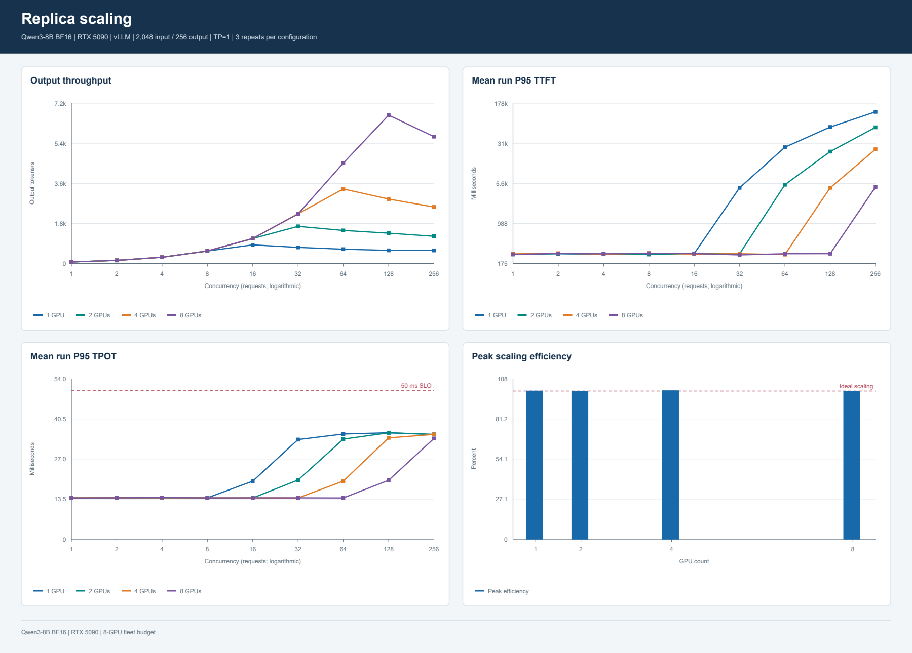

# InferScale

**A Kubernetes-native control and policy plane for multi-tenant text-generation inference.**

Serving models well means managing latency tails, queue and cache pressure, tenant isolation, and safe changes to live deployments. InferScale connects deployment control, request admission, routing, scaling, and progressive rollout so operators can manage those concerns through Kubernetes.

The stack includes Go and Python services and tooling, Kubernetes, PostgreSQL, Valkey, KEDA, Prometheus and Grafana, OpenTelemetry and Tempo, and DCGM.

[Architecture](#architecture) · [Capabilities](#what-inferscale-handles) · [API walkthrough](#api-walkthrough) · [Local setup](#local-control-plane-quickstart) · [Monitoring](#observability) · [Repository map](#repository-map) · [Further reading](#further-reading)

## What InferScale handles

| Capability | Mechanism |
| --- | --- |
| Deployment management | Tenant-scoped API, immutable revisions, durable operations, and a PostgreSQL outbox |
| Request admission | Envoy external authorization, scoped API keys, and atomic Valkey rate limits |
| Model serving | Per-revision inference pools backed by vLLM or TensorRT-LLM |
| Tenant isolation | Dedicated runtime and inference-pool boundaries, exclusive GPU allocation, and network policy |
| Scaling and routing | llm-d load- and prefix-aware endpoint selection; KEDA scaling from queued and running request counts |
| Safe changes | Progressive rollout with metric gates, pause behavior, and rollback to the stable revision |

## Architecture



The management API stores desired state and operations in PostgreSQL. Changes to the serving contract create an immutable candidate revision; policy-only changes update desired state. An outbox worker applies desired state to Kubernetes, where the controller reconciles runtime resources, routing, scaling, and status.

For inference, Envoy sends an authorization request to the admission service. After authorization, the inference request proceeds through the llm-d InferencePool to the selected runtime. Existing streams remain on their selected revision; new requests use the revision selected by the active route.

### Responsibilities

| Component | Responsibility |
| --- | --- |
| `inferscale-api` | Tenant-scoped deployment CRUD, immutable revisions, benchmark operations, and durable operations |
| `inferscale-controller` | Reconciles `InferenceDeployment` resources, runtime resources, cache jobs, routing, scaling, and status |
| `inferscale-admission` | Envoy external authorization, API-key checks, ownership, rate limits, and trusted request metadata |
| Envoy Gateway | Gateway API routing and the public inference entry point |
| llm-d | InferencePool scheduling, endpoint selection, and cache-aware routing |
| vLLM / TensorRT-LLM | Model execution, batching, KV-cache management, tensor parallelism, and kernels |

Runtime adapters support vLLM and TensorRT-LLM. Backend selection uses compatible runtime profiles, with vLLM as the default fallback.

## Deployment lifecycle



A create or update returns `202 Accepted` with an operation ID. Poll `GET /v1/operations/{operation_id}` for the operation and `GET /v1/deployments/{deployment_id}` for deployment status. `PATCH` requires an `If-Match` ETag. Idempotency keys are bound to request fingerprints, so reusing a key with a different request conflicts. Kubernetes status tracks the observed generation.

Progressive rollout advances through **ready → shadow → canary (5%) → 25% → 50% → 100% → stable**. Each step evaluates fresh metrics, sample counts, dwell time, latency, errors, queue pressure, and runtime health. Missing metrics pause promotion. A failed candidate can be rolled back to the stable revision.

## Tenant and GPU model

Each tenant has a Kubernetes namespace. Each deployment and revision receives a dedicated runtime and inference-pool boundary with exclusive GPU allocation. Tensor parallelism runs across GPUs on one host. Set `gpu.count` to the tensor-parallel size; total GPU allocation is `replicas × tensor_parallelism`. Reserve capacity for rollout headroom.

For example, an eight-GPU host can allocate eight TP1 workers, four TP2 workers, or two TP4 workers. KV and prefix caches remain isolated between tenants.

## Model cache and runtime

Model references use `hf://owner/repository` and a full, immutable 40-character model commit. The node-local cache stages downloads, verifies file hashes, and atomically publishes read-only model files. Cache identity includes a SHA-256 model identity; corrupt entries are quarantined.

TensorRT-LLM engine cache identity also includes the runtime image, model revision, precision and quantization, tensor-parallel size, maximum context, and GPU architecture.

KEDA scales from queued and running request counts reported by the llm-d endpoint picker. If a query fails repeatedly, a configured fallback replica count applies. During shutdown, workers drain requests before termination.

## API walkthrough

This example assumes a configured GPU cluster, a provisioned tenant, and an API key created by an operator. Replace the model revision placeholder with the model’s full 40-character Hugging Face commit before sending the request.

Save as `deployment.json`:

```json
{
  "name": "qwen3-8b",
  "model": {"uri": "hf://Qwen/Qwen3-8B", "revision": "<40-character-model-commit>"},
  "backend": "vllm",
  "precision": "bf16",
  "quantization": "none",
  "gpu": {"type": "RTX_5090", "count": 1},
  "tensor_parallelism": 1,
  "max_model_len": 8192,
  "prefix_caching": true,
  "min_replicas": 1,
  "max_replicas": 4,
  "slo": {"ttft_p95_ms": 750, "tpot_p95_ms": 50},
  "admission": {
    "maxConcurrentRequests": 32,
    "maxQueuedRequests": 64,
    "priorityClass": "standard"
  },
  "routing": {"policy": "load-aware"},
  "rollout": {"strategy": "progressive", "shadowPercent": 10},
  "observability": {"tracing": true}
}
```

Submit the deployment and retain the returned operation and deployment IDs:

```bash
export INFERSCALE_API_URL="https://YOUR-GATEWAY-HOST"
export INFERSCALE_API_KEY="YOUR-TENANT-API-KEY"

curl --fail-with-body -sS \
  "$INFERSCALE_API_URL/v1/deployments" \
  -H "Authorization: Bearer $INFERSCALE_API_KEY" \
  -H "Content-Type: application/json" \
  -H "Idempotency-Key: qwen3-8b-initial" \
  --data-binary @deployment.json
```

Poll the operation and inspect deployment status. Send inference after the deployment is ready:

```bash
export DEPLOYMENT_ID="YOUR-DEPLOYMENT-ID"

curl --no-buffer -sS --fail-with-body \
  "$INFERSCALE_API_URL/v1/deployments/$DEPLOYMENT_ID/chat/completions" \
  -H "Authorization: Bearer $INFERSCALE_API_KEY" \
  -H "Content-Type: application/json" \
  --data '{
    "model": "qwen3-8b",
    "messages": [
      {"role": "user", "content": "Explain prefix caching in three sentences."}
    ],
    "max_tokens": 256,
    "stream": true
  }'
```

The request’s `model` field matches the deployment name. The inference request goes through the gateway and admission path.

## Local control-plane quickstart

The GPU-free local control plane starts the API and supporting services for development.

**Prerequisites:** Ubuntu or WSL2, Docker, Go, Python 3.10+, `kubectl`, `k3d`, and `curl`. See [`versions.lock.yaml`](versions.lock.yaml) for pinned tool versions.

```bash
cp .env.example .env
make dev-up
make dev-status
```

The stack includes PostgreSQL, Valkey, Prometheus, Grafana, Tempo, and OpenTelemetry components. Follow the [development setup guide](docs/development/setup.md) for configuration and the [GPU deployment guide](docs/deployment/vast-5090.md) to deploy on a GPU host.

To open the local Grafana service:

```bash
kubectl -n inferscale-monitoring port-forward svc/grafana 3000:3000
```

Then visit `http://localhost:3000`.

## Observability

InferScale tracks TTFT (time to first token) and TPOT (time per output token) latency percentiles, goodput, SLOs, queue pressure, cache behavior, startup, rollout state, GPU health, tenant fairness, and resource use.



*Fleet view: request traffic, latency, GPU capacity, and SLO attainment.*



*Replica scaling chart for Qwen3-8B BF16 with TP1 workers on 1, 2, 4, and 8 RTX 5090 GPUs, using a 2048-token input and 256-token output.*

Browse the [monitoring chart index](monitoring/README.md). Live Grafana dashboards are in [`observability/dashboards/`](observability/dashboards/).

## Benchmarking

The benchmark harness uses versioned scenarios and normalized JSON artifacts with model, runtime, hardware, and workload identity. Compatibility profiles support comparisons across matching configurations. See the [benchmark methodology](docs/benchmarks/methodology.md), [remote runbook](docs/benchmarks/remote-runbook.md), [runner](benchmarks/runner/README.md), and [analysis tools](benchmarks/analysis/README.md).

## Security

- API keys are stored as Argon2 hashes, scoped, revocable, and revealed only once.
- Admission checks tenant ownership; cross-tenant resource lookups return `404`.
- Workers run as non-root and use service accounts without mounted Kubernetes API tokens. Network policy is default-deny.
- Prometheus labels are bounded; prompts, completions, and authentication secrets are not logged.
- TLS is configured for deployments outside the isolated local development environment.

## Repository map

| Path | Contents |
| --- | --- |
| [`api/openapi/`](api/openapi/) | Management, control, and inference API specifications |
| [`api/crds/`](api/crds/) | Kubernetes custom resource definition manifests |
| [`api/platform/`](api/platform/) | Kubernetes API types |
| [`cmd/`](cmd/) | API, controller, admission, CLI, and migration entry points |
| [`internal/`](internal/) | Deployment, tenant, runtime adapters, routing, rollout, storage, and policy logic |
| [`modelcache/`](modelcache/) | Model cache implementation and documentation |
| [`runtime/`](runtime/) | Runtime entry points, images, and TensorRT-LLM exporter |
| [`deploy/`](deploy/) | Kubernetes deployment configuration |
| [`infra/`](infra/) | Infrastructure configuration |
| [`observability/`](observability/) | Metrics documentation and Grafana dashboards |
| [`monitoring/`](monitoring/) | Monitoring chart library and index |
| [`benchmarks/`](benchmarks/) | Benchmark scenarios, runner, and analysis |
| [`docs/`](docs/) | Architecture, setup, deployment, benchmark, and runbook guides |
| [`scripts/`](scripts/) | Development and operations scripts |

## Further reading

**Architecture:** [Overview](docs/architecture/overview.md) · [Revision lifecycle](docs/architecture/revision-lifecycle.md) · [Security](docs/architecture/security.md) · [Code specification](INFERSCALE_CODEX_SPEC.md)

**Operations:** [Development setup](docs/development/setup.md) · [GPU deployment](docs/deployment/vast-5090.md) · [Rollout runbook](docs/runbooks/rollout.md) · [Dependency outage](docs/runbooks/dependency-outage.md) · [Model-cache failure](docs/runbooks/model-cache-failure.md)

**Benchmarks:** [Methodology](docs/benchmarks/methodology.md) · [Remote runbook](docs/benchmarks/remote-runbook.md) · [Runner](benchmarks/runner/README.md) · [Analysis](benchmarks/analysis/README.md)

**Design decisions:** [Transactional outbox](docs/decisions/0008-transactional-outbox.md) · [Tenant-dedicated runtime pools](docs/decisions/0003-tenant-dedicated-runtime-pools.md) · [Exclusive GPU allocation](docs/decisions/0012-exclusive-gpu-allocation.md)

**Reference:** [OpenAPI specifications](api/openapi/openapi.yaml) · [Runtime](runtime/README.md) · [Model cache](modelcache/README.md) · [Deployment configuration](deploy/README.md) · [Metrics](observability/metrics.md)
